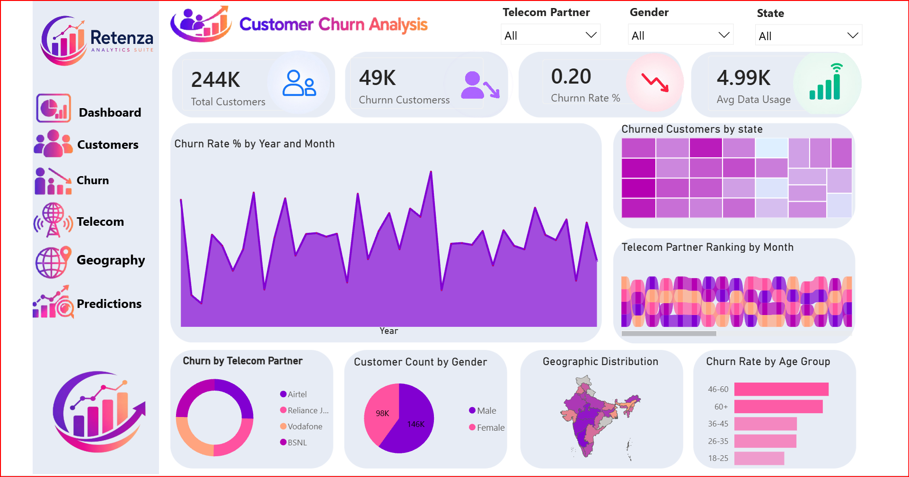
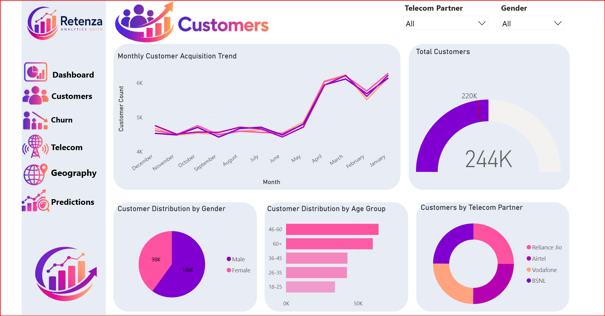
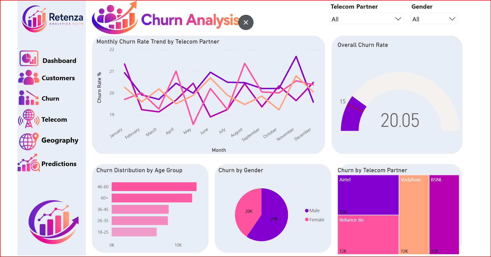
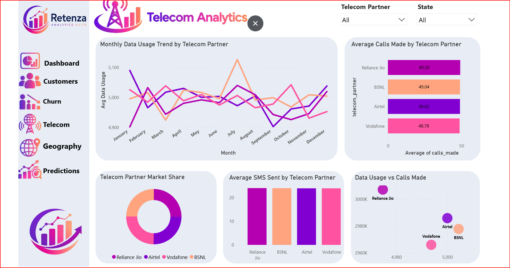
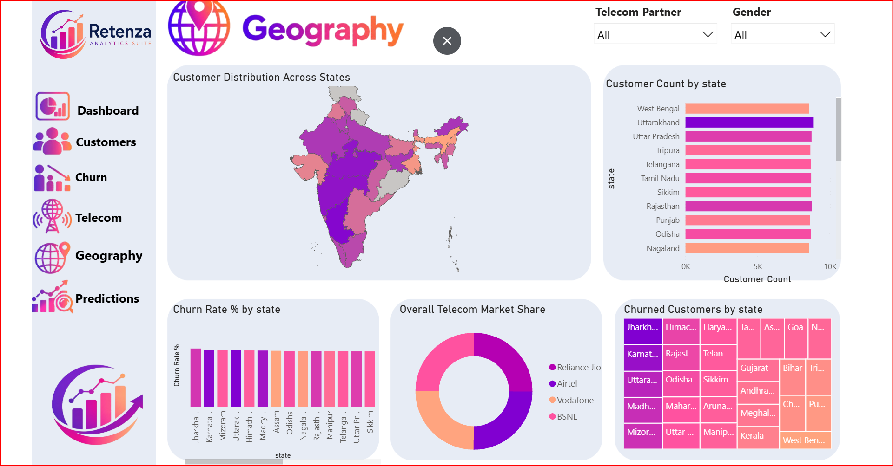
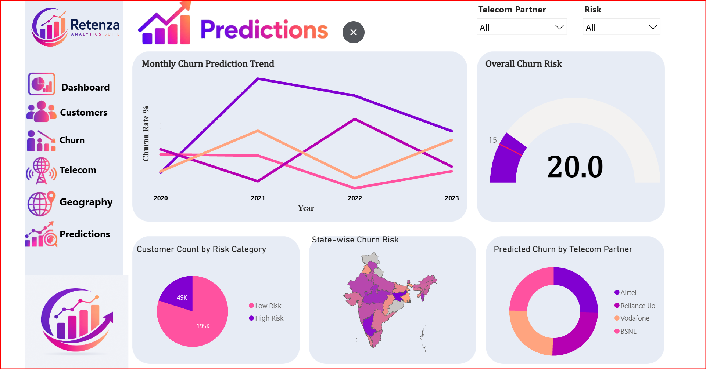

# 📊 Telecom Customer Churn Analytics

A complete **Power BI Business Intelligence project** built to analyze customer churn in the telecom industry.

This dashboard helps identify customer behavior, churn patterns, telecom partner performance, geographical distribution, and future churn trends using interactive Power BI visualizations.

---

## 🚀 Live Dashboard

🔗 **Power BI Report**

https://app.powerbi.com/view?r=eyJrIjoiZjc0Mzk2MTUtODBhYi00OTJkLTg1NDEtMGMyZWJkNzczNmEwIiwidCI6ImUxNGU3M2ViLTUyNTEtNDM4OC04ZDY3LThmOWYyZTJkNWE0NiIsImMiOjEwfQ%3D%3D

---

# 📌 Project Overview

Customer churn is one of the biggest challenges for telecom companies. Losing existing customers directly impacts revenue and customer acquisition costs.

The goal of this project was to build an interactive Power BI solution that enables business users to:

- Monitor customer churn
- Identify high-risk customers
- Compare telecom partners
- Analyze customer demographics
- Explore state-wise customer distribution
- Track customer trends over time
- Support business decisions with interactive dashboards

---

# 📊 Dashboard Pages

This report contains **6 interactive pages**.

## 🏠 Dashboard

Executive overview of customer churn.

### Includes

- Total Customers
- Churned Customers
- Churn Rate %
- Average Data Usage
- Monthly Churn Trend
- State-wise Customer Distribution
- Churn by Telecom Partner
- Gender Distribution
- Age Group Analysis



---

## 👥 Customers

Customer demographic analysis.

### Includes

- Customer Growth
- Gender Distribution
- Age Groups
- Telecom Partner Distribution
- Customer KPIs



---

## 📉 Churn Analysis

Detailed churn insights.

### Includes

- Monthly Churn Trend
- Churn by Gender
- Churn by Age Group
- Churn by Telecom Partner
- Overall Churn Rate



---

## 📡 Telecom Analytics

Telecom provider performance comparison.

### Includes

- Data Usage
- Calls Made
- SMS Sent
- Market Share
- Provider Rankings



---

## 🌍 Geography

Customer distribution across Indian states.

### Includes

- State-wise Customer Count
- Customer Distribution Map
- Churn Rate by State
- Market Share
- Churned Customers by State



---

## 🔮 Predictions

Future churn insights.

### Includes

- Monthly Churn Prediction
- Risk Categories
- State-wise Risk Analysis
- Predicted Churn by Telecom Partner



---

# 📈 Dashboard Highlights

✔ Interactive slicers

✔ Cross-filtering

✔ Custom Power BI theme

✔ Custom navigation panel

✔ KPI Cards

✔ Shape Map

✔ Treemap

✔ Ribbon Chart

✔ Area Chart

✔ Gauge Chart

✔ Donut Charts

✔ Predictive Dashboard

---

# 🛠 Tools & Technologies

- Power BI Desktop
- DAX
- Power Query
- Microsoft Excel / CSV
- Shape Maps
- Power BI Service

---

# 📂 Dataset

- Telecom Customer Dataset
- ~244K Records
- 4 Telecom Partners
- Indian States
- Customer Demographics
- Churn Status
- Data Usage
- Calls Made
- SMS Sent

---

# 📁 Repository Structure

```
Telecom-Customer-Churn-Analytics
│
├── CUSTOMER CHURN DASHBOARD.pbix
├── telecom_churn.csv
├── Readme.md
│
└── Image
    ├── Dashboard.png
    ├── customer.png
    ├── churn.png
    ├── telecom.png
    ├── geography.png
    └── predictions.png
```

---

# 💡 Key Insights

- Overall churn rate is approximately **20%**.
- Customers aged **46–60** have the highest churn rate.
- Around **49K customers** are classified as high risk.
- Customer distribution varies significantly across Indian states.
- Telecom providers have similar average call activity, suggesting churn may be influenced by factors other than usage.

---

# ▶ Run Locally

Clone this repository

```bash
git clone https://github.com/KunalAnand7222/Telecom-Customer-Churn-Analytics.git
```

Open

```
CUSTOMER CHURN DASHBOARD.pbix
```

Refresh the data source if prompted and explore the report.

---

# 👨‍💻 About This Project

This project was developed as part of my Power BI portfolio to demonstrate business intelligence, data visualization, dashboard design, and DAX skills using a telecom customer churn dataset.

---

## ⭐ If you found this project useful, consider giving it a Star.
